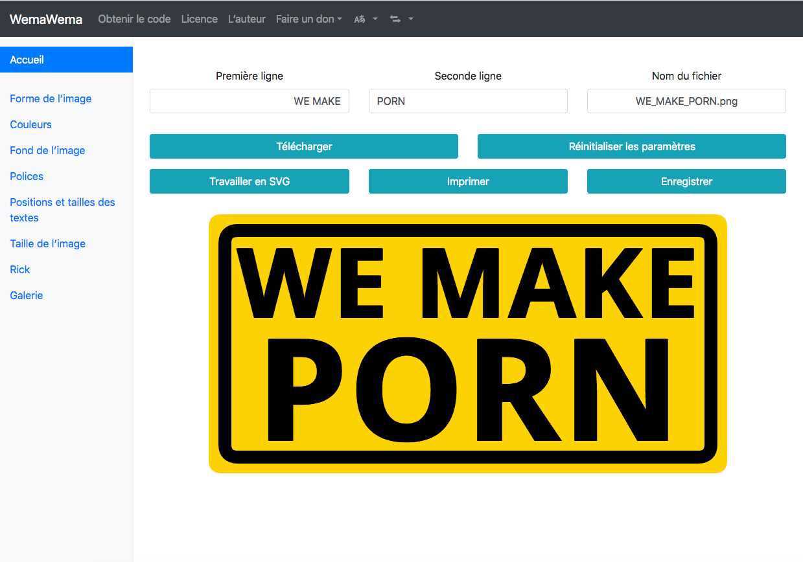

# WemaWema for YunoHost

[](https://dash.yunohost.org/appci/app/wemawema)    
[](https://install-app.yunohost.org/?app=wemawema)

*[Lire ce readme en français.](./README_fr.md)*

> *This package allows you to install WemaWema quickly and simply on a YunoHost server.  
If you don't have YunoHost, please consult [the guide](https://yunohost.org/#/install) to learn how to install it.*

## Overview

WemaWema is a *WE MAKE PORN* meme generator, but it can do more.

**Shipped version:** 26.1

## Screenshots



## Demo

* [Official demo](https://luc.frama.io/wemawema/?w=WE+MAKE&wx=400&wy=160&ws=150&wc=%23000000&wa=0&wf=Open+Sans&wfs=bold&ww=725&p=PORN&px=400&py=350&ps=220&pc=%23000000&pa=0&pf=Open+Sans&pfs=bold&pw=725&co=%23fcd205&ra=0&gli=false&bgt=plain&rc=%23000000&bgr=%23fcd205&egr=%23ffffff&or=lr&bgi=beer&cor=20&bth=20&width=800&height=400&x=0&y=0&s=1.000&bgu=&r=false&rx=0&ry=0&rs=100&rr=0&woc=%23ffffff&wos=0&poc=%23ffffff&pos=0)

## Documentation

 * Official documentation: https://framagit.org/luc/wemawema
 * YunoHost documentation: If specific documentation is needed, feel free to contribute.

## YunoHost specific features

#### Multi-user support

* Are LDAP and HTTP auth supported? **No**
* Can the app be used by multiple users? **Yes**

#### Supported architectures

* x86-64 - [](https://ci-apps.yunohost.org/ci/apps/wemawema/)
* ARMv8-A - [](https://ci-apps-arm.yunohost.org/ci/apps/wemawema/)

## Limitations

* Any known limitations.

## Additional information

* Other info you would like to add about this app.

## Links

 * Report a bug: https://github.com/YunoHost-Apps/wemawema_ynh/issues
 * App website: https://luc.frama.io/wemawema
 * Upstream app repository: https://framagit.org/luc/wemawema
 * YunoHost website: https://yunohost.org/

---

## Developer info

Please send your pull request to the [testing branch](https://github.com/YunoHost-Apps/wemawema_ynh/tree/testing).

To try the testing branch, please proceed like that.
```
sudo yunohost app install https://github.com/YunoHost-Apps/wemawema_ynh/tree/testing --debug
or
sudo yunohost app upgrade wemawema -u https://github.com/YunoHost-Apps/wemawema_ynh/tree/testing --debug
```
