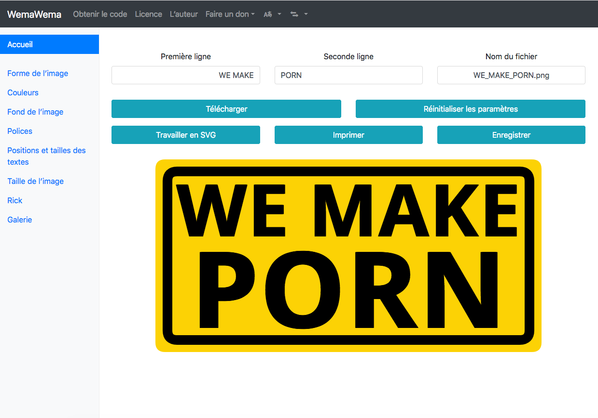

# WemaWema pour YunoHost

[](https://dash.yunohost.org/appci/app/wemawema)    
[](https://install-app.yunohost.org/?app=wemawema)

*[Read this readme in english.](./README.md)* 

> *Ce package vous permet d'installer WemaWema rapidement et simplement sur un serveur YunoHost.  
Si vous n'avez pas YunoHost, consultez [le guide](https://yunohost.org/#/install) pour apprendre comment l'installer.*

## Vue d'ensemble
WemaWema est un générateur de mèmes *WE MAKE PORN*.

**Version incluse :** 26.1

## Captures d'écran



## Démo

* [Démo officielle](https://luc.frama.io/wemawema/?w=WE+MAKE&wx=400&wy=160&ws=150&wc=%23000000&wa=0&wf=Open+Sans&wfs=bold&ww=725&p=PORN&px=400&py=350&ps=220&pc=%23000000&pa=0&pf=Open+Sans&pfs=bold&pw=725&co=%23fcd205&ra=0&gli=false&bgt=plain&rc=%23000000&bgr=%23fcd205&egr=%23ffffff&or=lr&bgi=beer&cor=20&bth=20&width=800&height=400&x=0&y=0&s=1.000&bgu=&r=false&rx=0&ry=0&rs=100&rr=0&woc=%23ffffff&wos=0&poc=%23ffffff&pos=0)

## Documentation

 * Documentation officielle : https://framagit.org/luc/wemawema
 * Documentation YunoHost : Si une documentation spécifique est nécessaire, n'hésitez pas à contribuer.

## Caractéristiques spécifiques YunoHost

#### Support multi-utilisateur

* L'authentification LDAP et HTTP est-elle prise en charge ? **Non**
* L'application peut-elle être utilisée par plusieurs utilisateurs ? **Oui**

#### Architectures supportées

* x86-64 - [](https://ci-apps.yunohost.org/ci/apps/wemawema/)
* ARMv8-A - [](https://ci-apps-arm.yunohost.org/ci/apps/wemawema/)

## Limitations

* Limitations connues.

## Informations additionnelles

* Autres informations que vous souhaitez ajouter sur cette application.

## Liens

 * Signaler un bug : https://github.com/YunoHost-Apps/wemawema_ynh/issues
 * Site de l'application : https://luc.frama.io/wemawema
 * Dépôt de l'application principale : https://framagit.org/luc/wemawema
 * Site web YunoHost : https://yunohost.org/

---

## Informations pour les développeurs

Merci de faire vos pull request sur la [branche testing](https://github.com/YunoHost-Apps/wemawema_ynh/tree/testing).

Pour essayer la branche testing, procédez comme suit.
```
sudo yunohost app install https://github.com/YunoHost-Apps/wemawema_ynh/tree/testing --debug
ou
sudo yunohost app upgrade wemawema -u https://github.com/YunoHost-Apps/wemawema_ynh/tree/testing --debug
```
