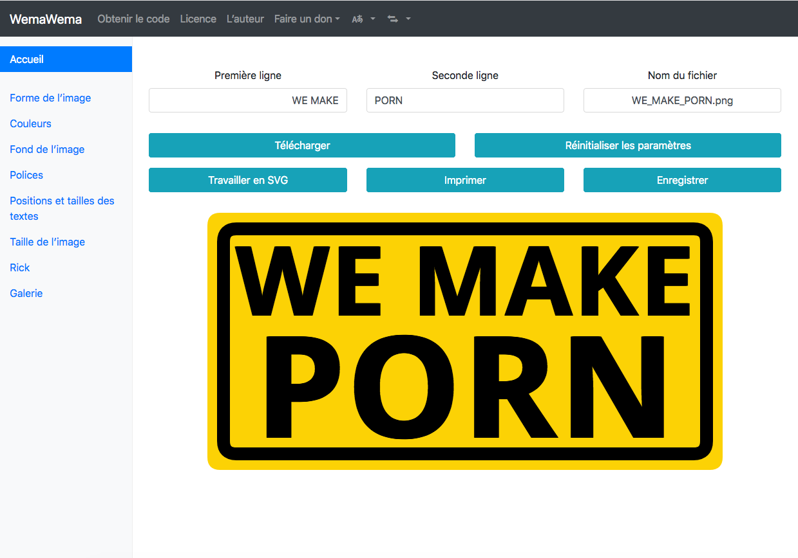

<!--
NOTA: Este README foi creado automáticamente por <https://github.com/YunoHost/apps/tree/master/tools/readme_generator>
NON debe editarse manualmente.
-->

# WemaWema para YunoHost

[](https://ci-apps.yunohost.org/ci/apps/wemawema/)


[](https://install-app.yunohost.org/?app=wemawema)

*[Le este README en outros idiomas.](./ALL_README.md)*

> *Este paquete permíteche instalar WemaWema de xeito rápido e doado nun servidor YunoHost.*  
> *Se non usas YunoHost, le a [documentación](https://yunohost.org/install) para saber como instalalo.*

## Vista xeral

WE MAKE PORN meme generator but it can do more.

**Versión proporcionada:** 30.1~ynh2

**Demo:** <https://framagit.org/luc/wemawema>

## Capturas de pantalla



## :red_circle: Debes considerar

- **Upstream not maintained**: This software is not maintained anymore. Expect it to break down over time, be exposed to unfixed security breaches, etc.

## Documentación e recursos

- Web oficial da app: <https://framagit.org/luc/wemawema>
- Repositorio de orixe do código: <https://framagit.org/luc/wemawema>
- Tenda YunoHost: <https://apps.yunohost.org/app/wemawema>
- Informar dun problema: <https://github.com/YunoHost-Apps/wemawema_ynh/issues>

## Info de desenvolvemento

Envía a túa colaboración á [rama `testing`](https://github.com/YunoHost-Apps/wemawema_ynh/tree/testing).

Para probar a rama `testing`, procede deste xeito:

```bash
sudo yunohost app install https://github.com/YunoHost-Apps/wemawema_ynh/tree/testing --debug
ou
sudo yunohost app upgrade wemawema -u https://github.com/YunoHost-Apps/wemawema_ynh/tree/testing --debug
```

**Máis info sobre o empaquetado da app:** <https://yunohost.org/packaging_apps>
